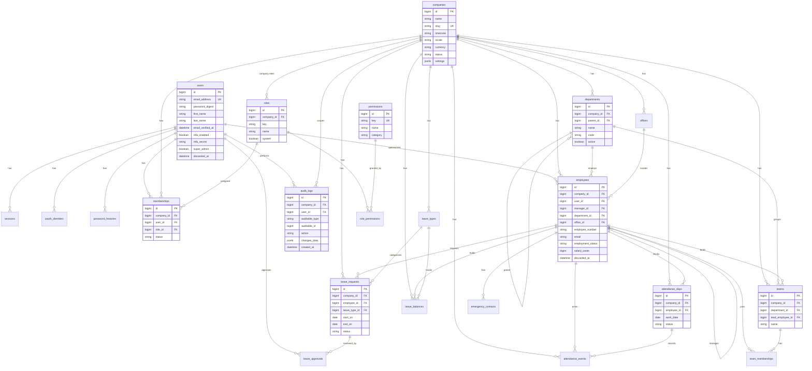

# Core Domain ER Diagram

Multi-tenant Employee Management System — identity, RBAC, org structure, people, attendance, leave, and audit.

## Tenancy notes

- `User` is global; access to a company is via `Membership` + `Role`.
- Tenant-scoped models include `Tenantable` (`acts_as_tenant :company`). Set tenant with `ActsAsTenant.current_tenant = company` or `Current.company = company`.
- Soft-delete people records with `discarded_at` (`Discard::Model` on `User` and `Employee`).
- `teams.lead_employee_id` FK is added after `employees` exists.
