# Use Case Overview

High-level map of who does what in EMS.

```mermaid
flowchart TB
  subgraph Actors
    Guest([Guest])
    Emp([Employee])
    Lead([Team Lead])
    Mgr([Manager])
    HR([HR])
    Owner([Company Owner])
    SA([Super Admin])
    API([API Client])
    IdP([External IdP])
  end

  subgraph Identity
    UC_Login((Sign in / OAuth / MFA))
    UC_Reset((Reset password))
    UC_Verify((Verify email))
  end

  subgraph CoreHR
    UC_Emp((Manage employees))
    UC_Dept((Manage departments))
    UC_Clock((Clock in/out))
    UC_Leave((Request / approve leave))
    UC_Perf((Performance reviews))
    UC_Asset((Assign assets))
    UC_Doc((Manage documents))
  end

  subgraph Insights
    UC_Dash((View dashboard))
    UC_Report((Run / export reports))
    UC_Search((Global search))
    UC_Org((View org chart))
  end

  subgraph Platform
    UC_Flag((Toggle feature flags))
    UC_Notify((View notifications))
    UC_Hook((Manage webhooks / SCIM))
  end

  Guest --> UC_Login
  Guest --> UC_Reset
  IdP --> UC_Login

  Emp --> UC_Login
  Emp --> UC_Verify
  Emp --> UC_Clock
  Emp --> UC_Leave
  Emp --> UC_Perf
  Emp --> UC_Dash
  Emp --> UC_Search
  Emp --> UC_Notify
  Emp --> UC_Org

  Lead --> UC_Clock
  Lead --> UC_Leave
  Lead --> UC_Perf
  Lead --> UC_Dash

  Mgr --> UC_Leave
  Mgr --> UC_Perf
  Mgr --> UC_Report
  Mgr --> UC_Emp

  HR --> UC_Emp
  HR --> UC_Dept
  HR --> UC_Leave
  HR --> UC_Perf
  HR --> UC_Asset
  HR --> UC_Doc
  HR --> UC_Report
  HR --> UC_Flag

  Owner --> UC_Emp
  Owner --> UC_Dept
  Owner --> UC_Asset
  Owner --> UC_Doc
  Owner --> UC_Report
  Owner --> UC_Flag
  Owner --> UC_Hook

  SA --> UC_Flag
  SA --> UC_Hook

  API --> UC_Clock
  API --> UC_Leave
  API --> UC_Emp
  API --> UC_Hook
```

## Actor → primary actions (summary)

| Actor | Can typically… |
|-------|----------------|
| Guest | Sign in, OAuth, password reset |
| Employee | Clock, request leave, self-review, search, notifications |
| Team Lead | Employee actions + limited team visibility |
| Manager | Approve leave, submit manager reviews, read reports |
| HR | Full people ops, assets, documents, leave admin, exports |
| Company Owner | Everything in the tenant |
| Super Admin | Platform-wide flags / integrations |
| API Client | JWT session, REST/GraphQL, SCIM, webhooks |

## Related UML

Sequence, state, C4, and RBAC docs are linked from [README.md](./README.md).

Still useful later:

1. **API sequence** — JWT auth + tenant header (`X-Company-Id`)  
2. **Data flow** — notification adapters in more detail  
3. **Activity diagrams** — attendance day lifecycle end-to-end  

Product / engineering follow-ons (code, not just docs):

- Live SAML/OIDC SSO  
- Richer SCIM + public API versioning  
- System specs toward ~95% coverage  
- Payroll / recruitment Hotwire UI (services exist)  
- Audit log browser UI  
- Calendar sync (Google/Outlook) use cases
