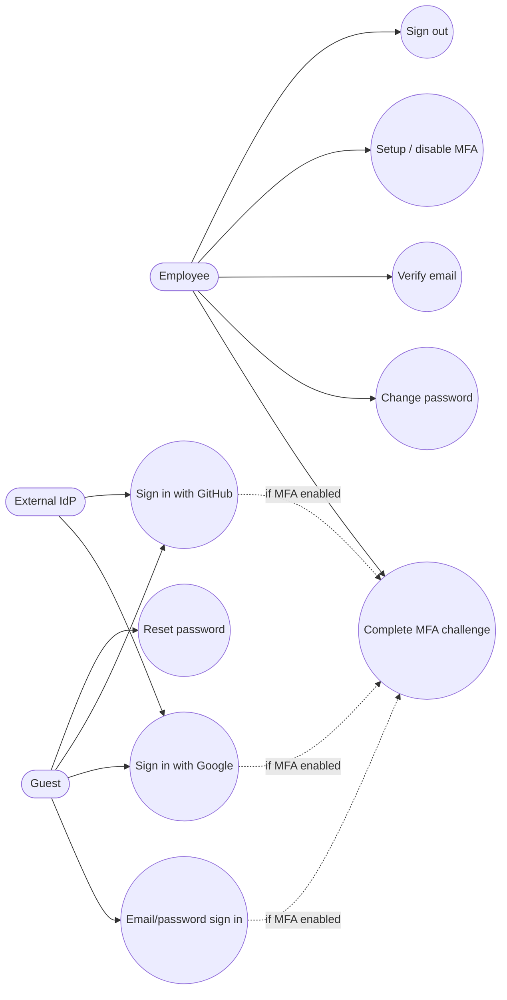

# Use Cases — Identity & Security

## Actors

- Guest  
- Employee (authenticated user)  
- External IdP (Google / GitHub)

## Diagram

## Actor actions

| Actor | Action | Outcome |
|-------|--------|---------|
| Guest | Email/password sign in | Session cookie created |
| Guest | OAuth via Google/GitHub | User + `OauthIdentity`; session started |
| Guest | Request password reset | Reset email (Letter Opener in dev) |
| Guest | Set new password | Password history enforced |
| Employee | Enter TOTP | MFA challenge clears; session continues |
| Employee | Verify email | `email_verified_at` set |
| Employee | Setup MFA | Secret + QR; enable with code |
| Employee | Disable MFA | MFA cleared |
| Employee | Sign out | Session destroyed |

## Notes

- Password history rejects reuse of last N digests.  
- OAuth buttons appear only when ENV client IDs are set.
