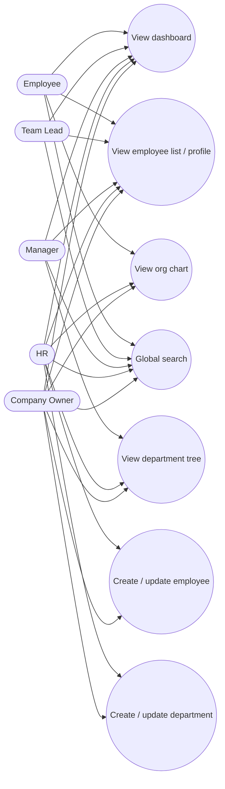

# Use Cases — People & Organization

## Actors

- Employee, Team Lead, Manager, HR, Company Owner

## Diagram

## Actor actions

| Actor | Action | Permission keys |
|-------|--------|-----------------|
| Any member | View dashboard widgets | (authenticated + tenant) |
| Employee+ | View employees | `employees.read` |
| HR / Owner | Create or update employee | `employees.create` / `employees.update` |
| Manager+ | View departments | `departments.read` |
| HR / Owner | Manage departments | `departments.manage` |
| Any with flag | View org chart | feature flag `org_chart` |
| Authenticated | Search people / depts | (search policy) |

## Notes

- All records are tenant-scoped (`company_id`).  
- Org chart is gated by feature flag.
