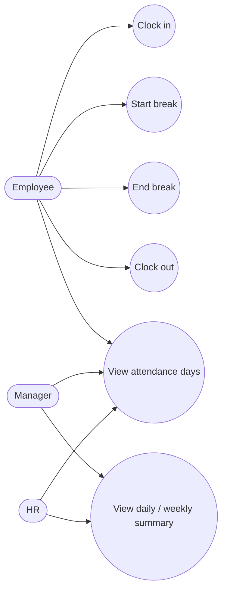

# Use Cases — Attendance

## Actors

- Employee (clock), Manager/HR (read/manage)

## Diagram

## Actor actions

| Actor | Action | Details |
|-------|--------|---------|
| Employee | Clock in | Creates/opens `AttendanceDay` + `clock_in` event; may mark late |
| Employee | Break start/end | `break_start` / `break_end` events |
| Employee | Clock out | Completes day; worked/overtime minutes |
| Manager/HR | View days | List/filter attendance |
| System | Missing clock-out | Prior open day → `missing_clock_out` on next clock-in |

## Notes

- Also available via REST (`/api/v1/attendance/clock_*`) and GraphQL `clockIn` mutation.  
- Permission: `attendance.clock` / `attendance.read` / `attendance.manage`.
