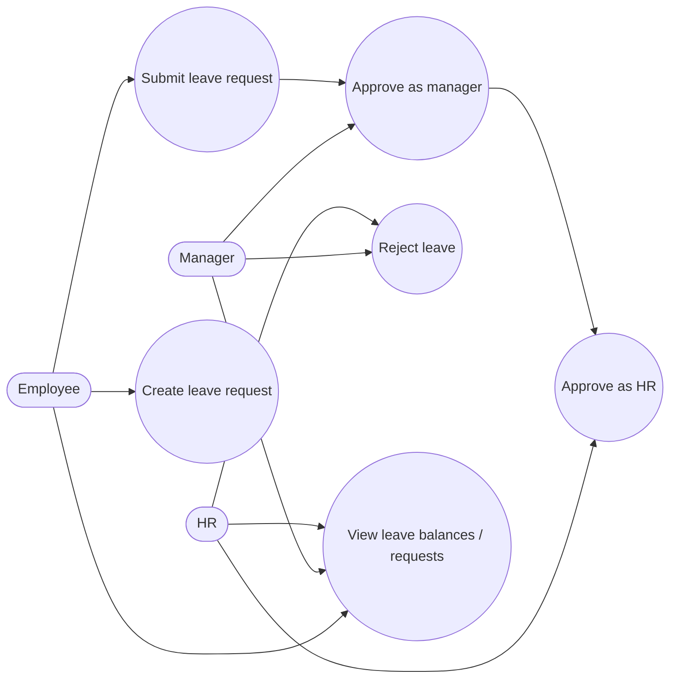
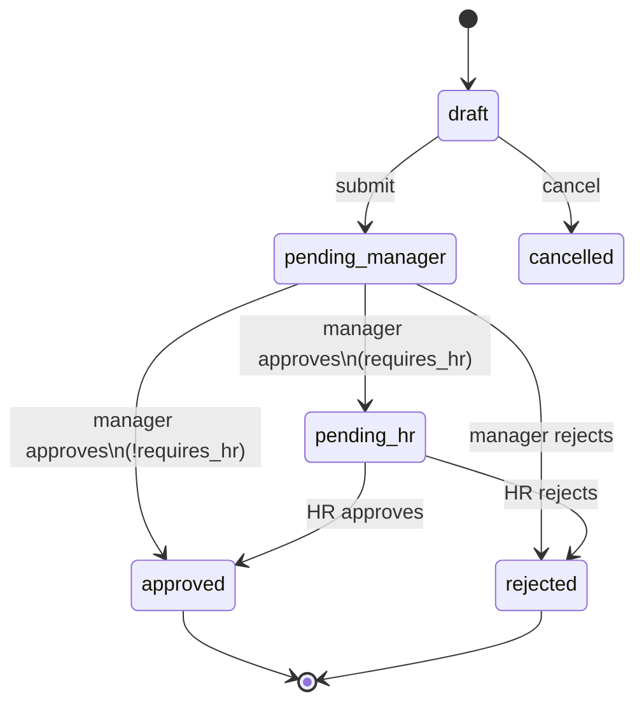

# Use Cases — Leave Management

## Actors

- Employee (request), Manager (first approval), HR (final approval)

## Diagram

## Workflow (happy path)

## Actor actions

| Actor | Action | Status transition |
|-------|--------|-------------------|
| Employee | Create draft / submit | → `pending_manager` |
| Manager | Approve | → `pending_hr` or `approved` |
| Manager | Reject | → `rejected` + reason |
| HR | Approve | → `approved` (+ notifications/webhooks) |
| HR | Reject | → `rejected` |
| Any with read | View requests/balances | — |

## Notes

- Leave types: annual, sick, maternity, paternity, remote, business trip, unpaid (seeded).  
- On approve: domain event → `NotificationJob` + webhook dispatch.
