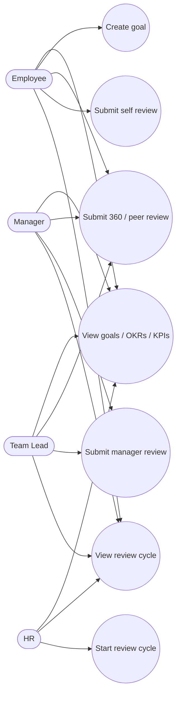

# Use Cases — Performance

## Actors

- Employee (self/peer), Manager/Team Lead (manager review), HR (cycles)

## Diagram

## Actor actions

| Actor | Action | Permission |
|-------|--------|------------|
| HR | Start quarterly/annual cycle | `performance.manage` |
| Employee | Submit self review | `performance.review` |
| Manager / Lead | Submit manager review | `performance.review` |
| Peer | Submit 360 feedback | `performance.review` |
| Employee+ | Create / track goals | create goal service |
| Any with read | View cycles / reviews | `performance.read` |

## Notes

- Review types: `self`, `manager`, `peer_360`.  
- Module can be gated by feature flag `performance_module`.
