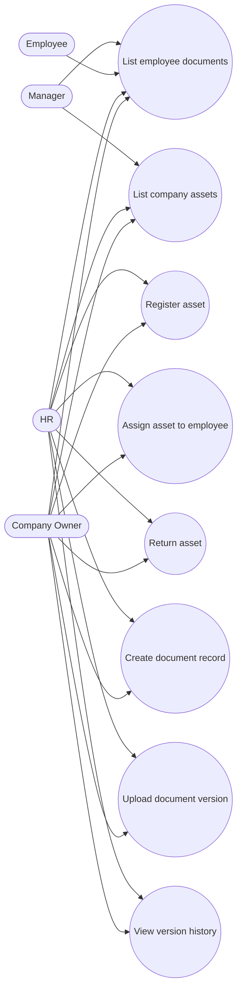

# Use Cases — Assets & Documents

## Actors

- HR / Company Owner (manage), Manager/Employee (read where permitted)

## Diagram

## Actor actions

| Actor | Action | Details |
|-------|--------|---------|
| HR/Owner | Register asset | laptop/phone/monitor/… + status |
| HR/Owner | Assign / return | `AssetAssignment`; status → assigned/returned |
| HR/Owner | Create document | passport/contract/visa/NDA/… |
| HR/Owner | Upload version | Active Storage file + version number |
| Manager | Read assets/docs | read permissions |
| Employee | Read own docs | when permitted |

## Notes

- Permissions: `assets.read` / `assets.manage`, `documents.read` / `documents.manage`.  
- Document versions store PDF/images/Word via Active Storage.
