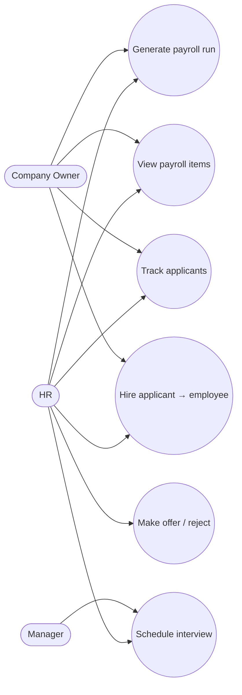

# Use Cases — Payroll & Recruitment

Foundation services exist; UI coverage is partial (portfolio next step).

## Actors

- HR, Company Owner (primary); Manager (interview feedback context)

## Diagram

## Actor actions

| Actor | Action | System result |
|-------|--------|---------------|
| HR/Owner | Generate monthly payroll | `PayrollRun` + `PayrollItem` (salary/bonus/tax/net) |
| HR | Move applicant stages | applied → interview → offer → hired/rejected |
| HR/Owner | Hire applicant | Creates `Employee`; emits `Employees::HiredEvent` |
| Manager | Participate in interview | Interview record + feedback |

## Notes

- `Payroll::GenerateRunService` and `Recruitment::HireApplicantService` are the command entry points.  
- Hotwire CRUD for these modules is a natural follow-on.
