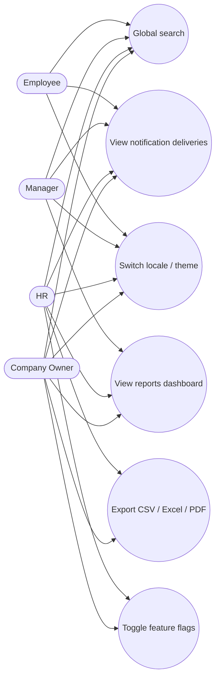

# Use Cases — Reports, Search & Platform

## Actors

- Employee (search/notify), Manager (reports read), HR/Owner (export/flags)

## Diagram

## Actor actions

| Actor | Action | Details |
|-------|--------|---------|
| Any | Search | pg_trgm on employees/departments |
| Manager+ | View report widgets | headcount, attendance, salary, attrition |
| HR/Owner | Export employees | CSV / XLSX / PDF |
| Any | View notifications | delivery log per channel |
| HR/Owner | Feature flags | dark_mode, org_chart, performance_module, … |
| Any | Locale | en / es / ru / uz / ky |
| Any | Dark mode | Stimulus + localStorage |

## Notification channels

Email · Slack · Teams · SMS · Telegram · in-app (adapters skip or stub when unconfigured).

## Calendar sync

Google Calendar and Outlook (Microsoft Graph) adapters sync **approved leave** and **interviews** into external calendars when a company has enabled `CalendarConnection` records. Sync attempts are stored as `CalendarEvent` rows (pending / synced / failed) and visible under Platform → Calendar. Local/dev uses stub mode (`settings["google_calendar_stub"]` / `outlook_calendar_stub`, or blank API base ENV) so events mark synced with a fake external id without calling live APIs.
