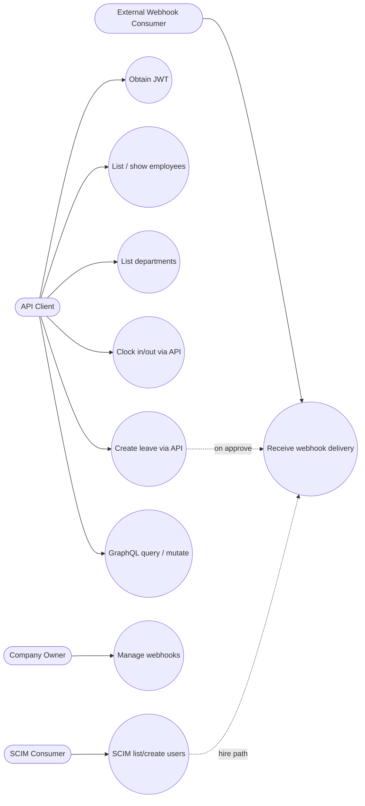

# Use Cases — API & Integrations

## Actors

- API Client (JWT), Company Owner/HR (webhook admin), External systems (SCIM/IdP)

## Diagram

## Actor actions

| Actor | Action | Endpoint / surface |
|-------|--------|--------------------|
| API Client | Login | `POST /api/v1/session` → JWT |
| API Client | CRUD-ish reads | `/api/v1/employees`, `/departments` |
| API Client | Attendance | `POST .../attendance/clock_in\|out` |
| API Client | Leave create | `POST /api/v1/leave_requests` |
| API Client | GraphQL | `POST /graphql` (+ Bearer / session) |
| Owner | Webhooks CRUD | `/api/v1/webhooks` |
| SCIM Consumer | Users | `/api/v1/scim/Users` (stub) |
| External system | Receive events | Signed HTTP POST from `Webhooks::DispatchService` |

## Cross-cutting

- Tenant: `X-Company-Id` when user has multiple memberships  
- Rate limit: Rack::Attack on auth + API  
- Version header: `X-API-Version`
