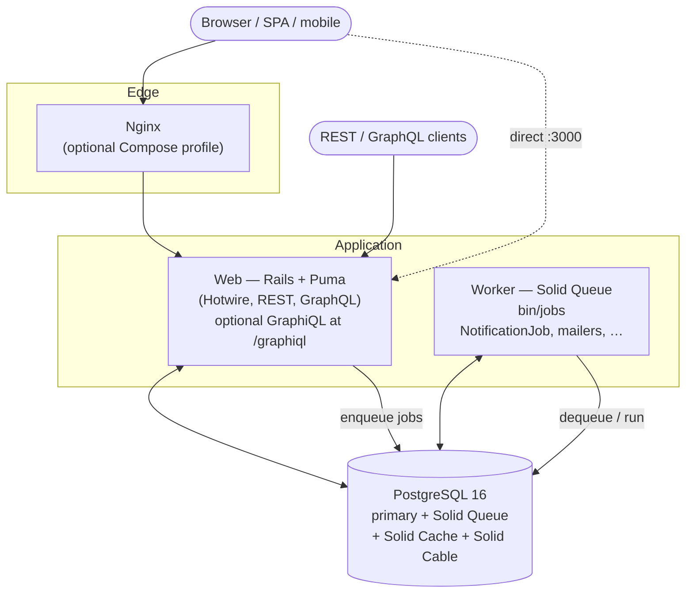

# C4 — Containers

Runtime containers for local Compose and typical deploy. Async work uses **Solid Queue** (`bin/jobs`); Postgres holds app data, queue, cache, and cable.

## Containers

| Container | Tech | Responsibility |
|-----------|------|----------------|
| **web** | Rails 8 + Puma (+ Thruster in Compose) | HTTP: sessions, Hotwire, REST, GraphQL; optional GraphiQL in non-prod |
| **worker** | Solid Queue (`./bin/jobs`) | `NotificationJob`, mailers, background side effects |
| **db** | Postgres 16 | Tenancy data + Solid Trifecta tables |
| **nginx** | nginx:1.27-alpine (Compose profile `nginx`) | Optional reverse proxy in front of web |
| **GraphiQL** | `GraphiQL::Rails::Engine` at `/graphiql` | Dev/ops GraphQL explorer (mounted in routes when enabled) |

Compose reference: `docker-compose.yml` (`web`, `worker`, `db`, optional `nginx`).
