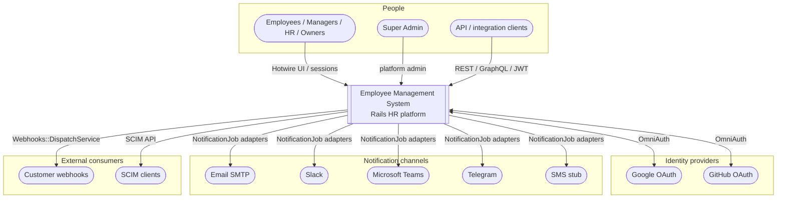

# C4 — System context

EMS as a multi-tenant HR SaaS. People and systems outside the boundary interact with the Employee Management System.

## Relationships

| Actor / system | Interaction |
|----------------|-------------|
| Company users | Browser sessions; RBAC via memberships/roles |
| Super Admin | Cross-tenant platform ops (flags, integrations) |
| Google / GitHub | OAuth identity; optional MFA after callback |
| Email / Slack / Teams / Telegram / SMS | Outbound notifications from domain events |
| Webhook endpoints | Signed delivery of domain events |
| API clients | JWT + tenant header; REST / GraphQL |

See also [docs/ARCHITECTURE.md](../../ARCHITECTURE.md).
