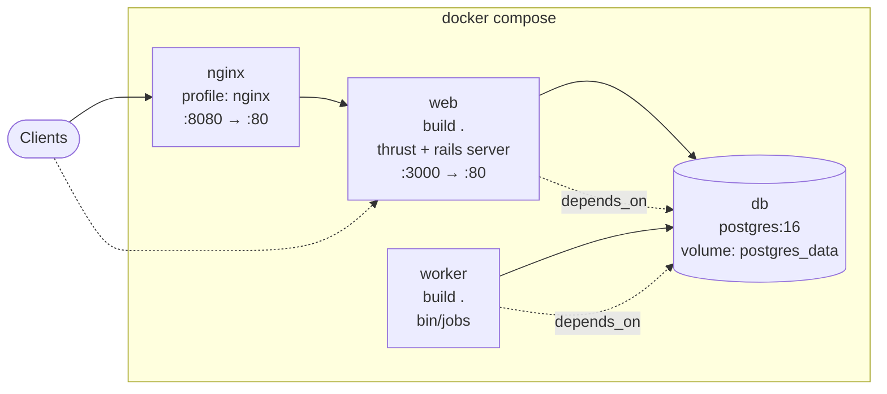
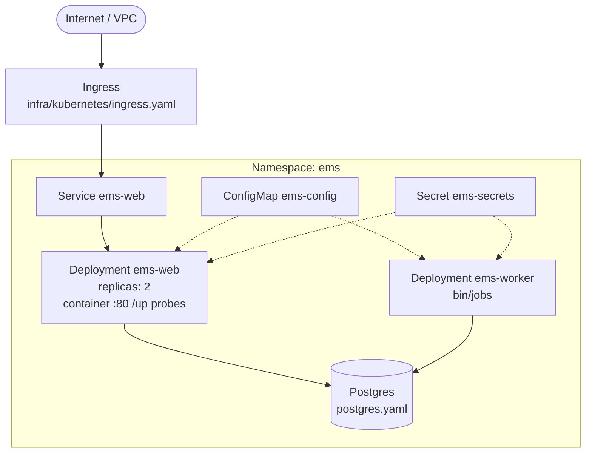

# Deployment — Docker Compose + Kubernetes sketch

## Docker Compose (local / single host)

From `docker-compose.yml`:

| Service | Notes |
|---------|--------|
| `db` | Healthcheck `pg_isready`; env `POSTGRES_*` |
| `web` | `SOLID_QUEUE_IN_PUMA=0` — jobs run in worker |
| `worker` | Same image; `command: ["./bin/jobs"]` |
| `nginx` | Optional; mounts `infra/nginx/default.conf` |

## Kubernetes sketch

Manifests under `infra/kubernetes/` (namespace `ems`): web Deployment + Service, worker Deployment, Postgres, ConfigMap/Secret, Ingress.

Apply order (from `infra/README.md`): namespace → configmap → secret → postgres → web/worker → ingress.

Placeholder image: `ghcr.io/example/employee-management-system:latest` — replace before real deploy. See [docs/DEPLOYMENT.md](../../DEPLOYMENT.md) when present.
