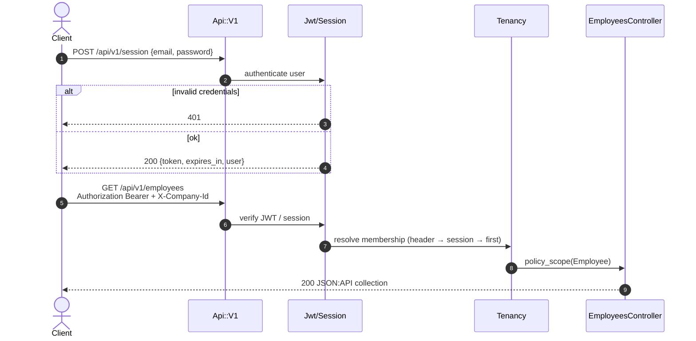

# API authentication sequence

JWT session creation and a subsequent tenant-scoped REST call.

## Notes

- OpenAPI contract: [`../openapi.yaml`](../openapi.yaml) (served at `/api-docs`).
- GraphQL uses the same session or JWT path via `GraphqlController`.
- SCIM endpoints authenticate with a company SCIM bearer token, not the user JWT.
