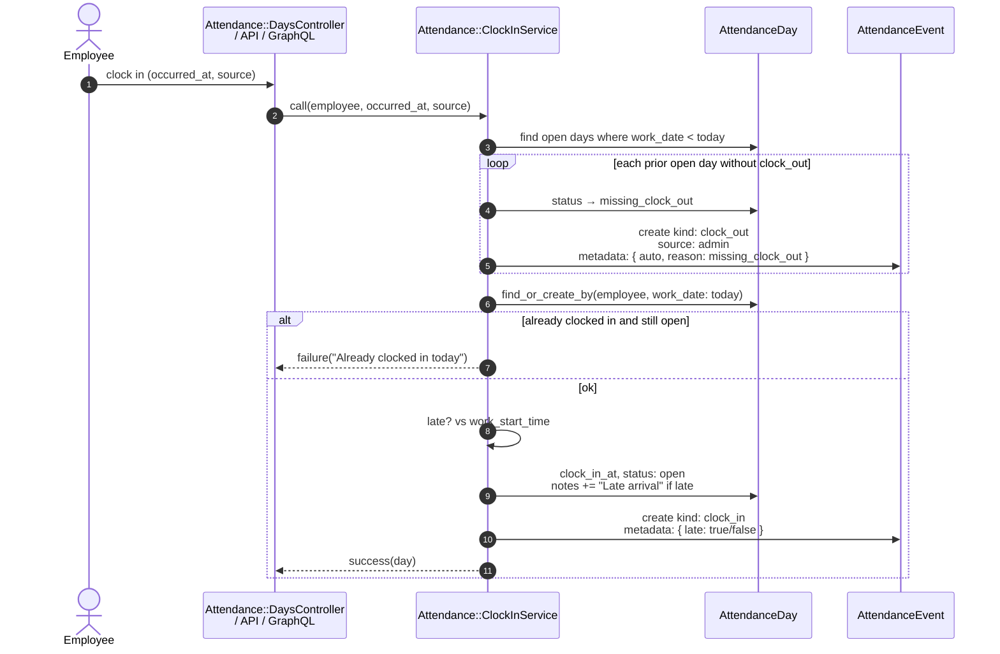

# Sequence — Clock in

Matches `Attendance::ClockInService` (web: `Attendance::DaysController`, API: `Api::V1::AttendanceController`, GraphQL: `Mutations::ClockIn`).

Before opening today, any prior `open` day without `clock_out_at` is closed as `missing_clock_out`. Late arrival is detected against `company.settings["work_start_time"]` (default `09:00`) in the company timezone.

## Code map

| Concern | Code |
|---------|------|
| Service | `Attendance::ClockInService` |
| Late flag | `late?` + event `metadata[:late]` |
| Auto-close | `close_previous_open_days!` → status `missing_clock_out` |
| Clock out (separate) | `Attendance::ClockOutService` |
