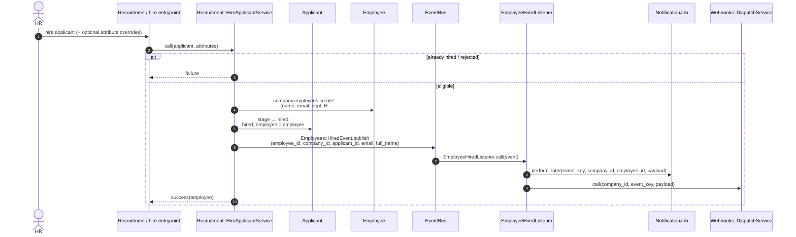

# Sequence — Hire applicant

Matches `Recruitment::HireApplicantService`, `Employees::HiredEvent`, and `EmployeeHiredListener`.

Applicant must not already be `hired` or `rejected`. Creates an `Employee`, sets applicant `stage: hired`, then publishes the domain event.

## Code map

| Step | Code |
|------|------|
| Hire | `Recruitment::HireApplicantService` |
| Event | `Employees::HiredEvent` |
| Subscription | `EventBus.subscribe` in `config/initializers/event_bus.rb` |
| Side effects | `EmployeeHiredListener` → `NotificationJob` + `Webhooks::DispatchService` |
