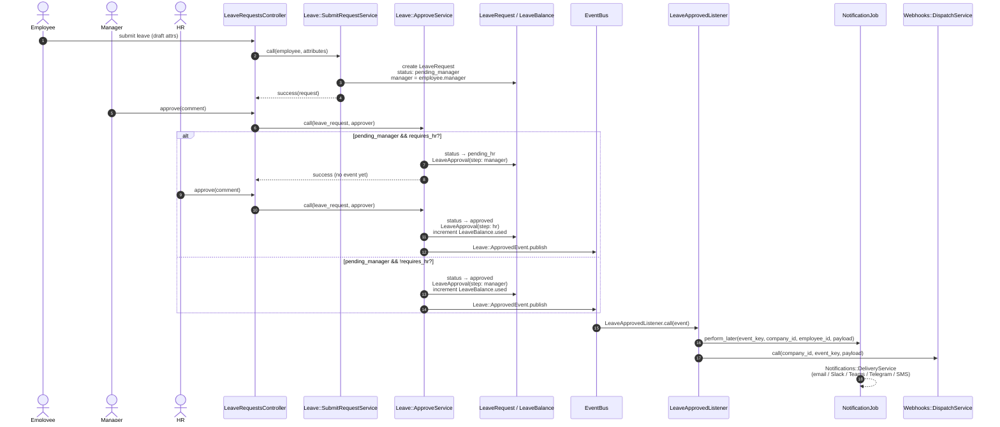

# Sequence — Leave submit & approve

Happy path matching `Leave::SubmitRequestService`, `Leave::ApproveService`, `Leave::ApprovedEvent`, and `LeaveApprovedListener`.

When `leave_type.requires_hr?` is false, manager approval goes straight to `approved` (same event/listener path).

## Code map

| Step | Code |
|------|------|
| Submit | `Leave::SubmitRequestService` — draft → `pending_manager` |
| Approve | `Leave::ApproveService` — manager and/or HR steps |
| Reject (alt) | `Leave::RejectService` — pending_* → `rejected` |
| Event | `Leave::ApprovedEvent` via `EventBus` (`config/initializers/event_bus.rb`) |
| Side effects | `LeaveApprovedListener` → `NotificationJob` + `Webhooks::DispatchService` |
