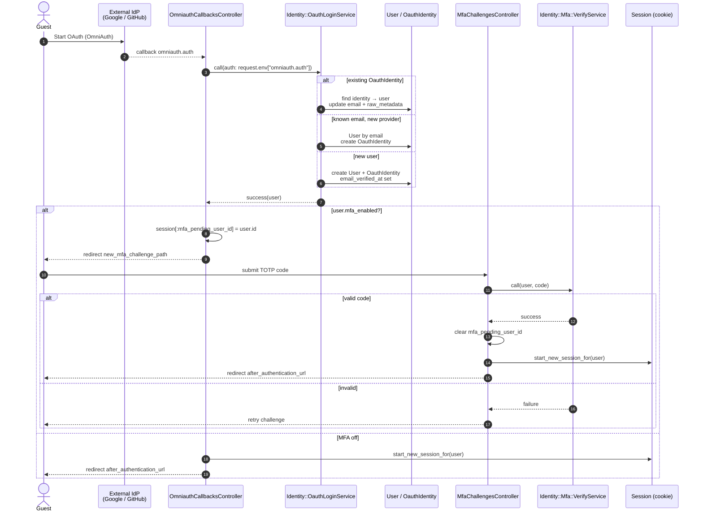

# Sequence — OAuth + optional MFA login

Matches `OmniauthCallbacksController`, `Identity::OauthLoginService`, MFA challenge (`MfaChallengesController` + `Identity::Mfa::VerifyService`), and session helpers (`start_new_session_for`).

Password login (`SessionsController#create`) uses the same MFA branch after `User.authenticate_by`.

## Code map

| Step | Code |
|------|------|
| OAuth callback | `OmniauthCallbacksController#create` |
| Identity link / signup | `Identity::OauthLoginService` |
| MFA gate | `complete_authentication_for` / `SessionsController#create` |
| Challenge | `MfaChallengesController` + `Identity::Mfa::VerifyService` |
| Session | `start_new_session_for(user)` (Authentication concern) |
